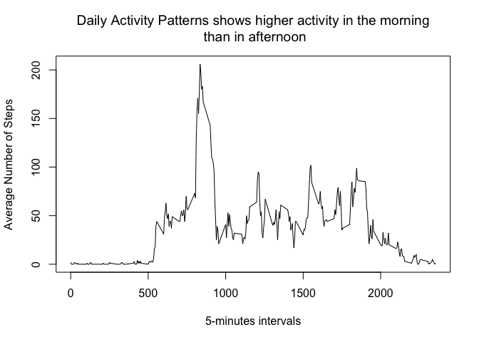
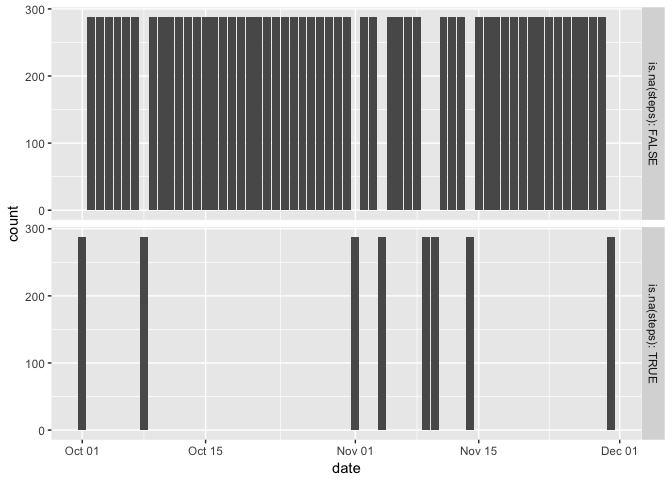
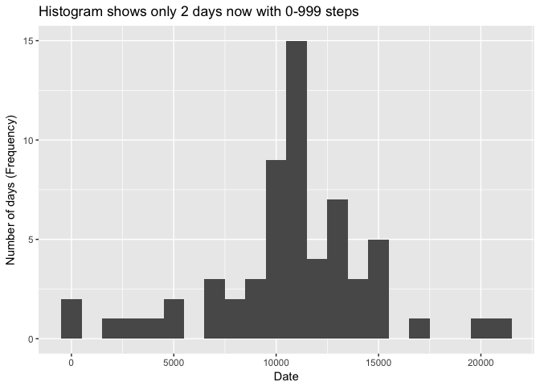
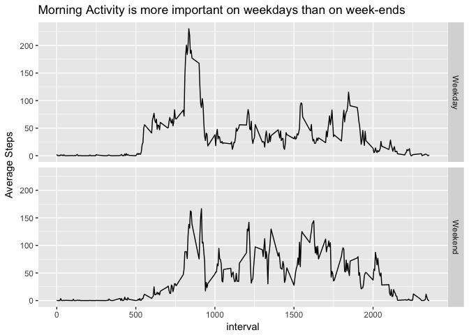

# Reproducible Research: Peer Assessment 1
Francois Brillon  
3/13/2017  

## Loading and preprocessing the data

### Loading library and setting Options


```r
knitr::opts_chunk$set(echo = TRUE)
setwd("~/Documents/coursera/reproducible-research/week2/RepData_PeerAssessment1")
library(dplyr)
```

```
## 
## Attaching package: 'dplyr'
```

```
## The following objects are masked from 'package:stats':
## 
##     filter, lag
```

```
## The following objects are masked from 'package:base':
## 
##     intersect, setdiff, setequal, union
```

```r
library(lubridate)
```

```
## 
## Attaching package: 'lubridate'
```

```
## The following object is masked from 'package:base':
## 
##     date
```

```r
library(ggplot2)
options( scipen = 6 )
```

### Loading data

Data Downloaded from GIT Repository on March 17, 2017, 8:52 PM, using GIT Clone.

* https://github.com/fbrillon/RepData_PeerAssessment1/blob/master/activity.zip


```r
zipfile <- "activity.zip"
unzip(zipfile)
```


```r
activity <- read.csv( "activity.csv", stringsAsFactors = FALSE )
```

### Explore/Process/transform the data (if necessary) into a format suitable for analysis


```r
summary(activity)
```

```
##      steps            date              interval     
##  Min.   :  0.00   Length:17568       Min.   :   0.0  
##  1st Qu.:  0.00   Class :character   1st Qu.: 588.8  
##  Median :  0.00   Mode  :character   Median :1177.5  
##  Mean   : 37.38                      Mean   :1177.5  
##  3rd Qu.: 12.00                      3rd Qu.:1766.2  
##  Max.   :806.00                      Max.   :2355.0  
##  NA's   :2304
```

```r
head(activity,n=20)
```

```
##    steps       date interval
## 1     NA 2012-10-01        0
## 2     NA 2012-10-01        5
## 3     NA 2012-10-01       10
## 4     NA 2012-10-01       15
## 5     NA 2012-10-01       20
## 6     NA 2012-10-01       25
## 7     NA 2012-10-01       30
## 8     NA 2012-10-01       35
## 9     NA 2012-10-01       40
## 10    NA 2012-10-01       45
## 11    NA 2012-10-01       50
## 12    NA 2012-10-01       55
## 13    NA 2012-10-01      100
## 14    NA 2012-10-01      105
## 15    NA 2012-10-01      110
## 16    NA 2012-10-01      115
## 17    NA 2012-10-01      120
## 18    NA 2012-10-01      125
## 19    NA 2012-10-01      130
## 20    NA 2012-10-01      135
```

Based on the preliminary analysis with summary and header of data, we could identify 2 transformation which will be required :

1. Convert the date string in a date/time object
2. Fill-in missing data (NAs)

Let's first change the "date" field data type. It will be easier then to analyse NAs.


```r
hours <- substring( activity$interval, 1)
tidyactivity <- activity %>% mutate( date = ymd( date ) )
```


```r
summary(tidyactivity)
```

```
##      steps             date               interval     
##  Min.   :  0.00   Min.   :2012-10-01   Min.   :   0.0  
##  1st Qu.:  0.00   1st Qu.:2012-10-16   1st Qu.: 588.8  
##  Median :  0.00   Median :2012-10-31   Median :1177.5  
##  Mean   : 37.38   Mean   :2012-10-31   Mean   :1177.5  
##  3rd Qu.: 12.00   3rd Qu.:2012-11-15   3rd Qu.:1766.2  
##  Max.   :806.00   Max.   :2012-11-30   Max.   :2355.0  
##  NA's   :2304
```

```r
head(tidyactivity)
```

```
##   steps       date interval
## 1    NA 2012-10-01        0
## 2    NA 2012-10-01        5
## 3    NA 2012-10-01       10
## 4    NA 2012-10-01       15
## 5    NA 2012-10-01       20
## 6    NA 2012-10-01       25
```

The date field is now in the proper format. There are still NAs in the steps fields which we need to analyse and fill appropriately.

## What is mean total number of steps taken per day?

### Histogram of number of steps taken each day (binwidth=1)


```r
perday <- tidyactivity %>%
                group_by( date ) %>%
                summarise( dailysteps=sum(steps, na.rm=TRUE) )

ggplot( perday, aes(x=dailysteps) ) + 
        geom_histogram( binwidth=1000 ) +
        xlab( "Date" ) +
        ylab( "Number of Days (Frequency)" ) +
        ggtitle( "Histogram revealed several days with missing data")
```

<!-- -->

### Total steps per day, daily Mean and Median, ignoring missing values


```r
dailyavg <- round(mean(perday$dailysteps))
dailymed <- round(median(perday$dailysteps))
```

The daily average of steps is **9354 steps**, excluding missing data.
The daily median of steps is **10395 steps**, excluding missing data.

## What is the average daily activity pattern?

### Steps by 5-minutes interval, averaged over all days

```r
perinterval <- tidyactivity %>%
                        group_by( interval ) %>%
                        summarise( avgsteps = round(mean(steps, na.rm=TRUE)) )

plot( perinterval$interval, perinterval$avgsteps, type="l",
      main="Daily Activity Patterns shows higher activity in the morning\n than in afternoon",
      xlab = "5-minutes intervals",
      ylab = "Average Number of Steps")
```

<!-- -->

Note that we chose to round the averaged number of steps to the closest integer in order to better represent the reality.

## Interval where maximum steps is observed

```r
maxinterval <- perinterval[perinterval$avgsteps == max(perinterval$avgsteps), ]
```

The **interval 835** contains the maximum number of average steps, which is **206 steps**.


## Imputing missing values

### Total Number of NA in the data set

```r
nacount <- nrow( tidyactivity[!complete.cases(tidyactivity),] )
```
There are **2304 rows** in the data set with missing (NA) values.

### Devise Strategy to fill missing values

```r
nas <- tidyactivity[is.na(tidyactivity$steps),]
ggplot( tidyactivity, aes( x=date ) ) +
        geom_bar() +
        facet_grid( is.na(steps)~. , labeller = label_both )
```

<!-- -->

Missing data is concentrated on specific days, on which all data is missing. There is no missing data mixed with valid data in other days.

Therfore, to fill missing data, we will simply use the average number of steps for the given interval computed over all days where data is available for the same interval. This is the same data shown in the t-series plot above, i.e. named "perinterval".

### Create new data set with missing values filled in

```r
filledtidyactivity <- tidyactivity %>%
                        left_join( perinterval ) %>%
                        mutate( steps = ifelse( is.na(steps), avgsteps, steps ) ) %>%
                        select( -avgsteps )
```

```
## Joining, by = "interval"
```

```r
summary(filledtidyactivity)
```

```
##      steps             date               interval     
##  Min.   :  0.00   Min.   :2012-10-01   Min.   :   0.0  
##  1st Qu.:  0.00   1st Qu.:2012-10-16   1st Qu.: 588.8  
##  Median :  0.00   Median :2012-10-31   Median :1177.5  
##  Mean   : 37.38   Mean   :2012-10-31   Mean   :1177.5  
##  3rd Qu.: 27.00   3rd Qu.:2012-11-15   3rd Qu.:1766.2  
##  Max.   :806.00   Max.   :2012-11-30   Max.   :2355.0
```

### Histogram of the total number of steps each day (missing values filled in)

```r
perdayfilled <- filledtidyactivity %>%
                group_by( date ) %>%
                summarise( dailysteps=sum(steps) )

ggplot( perdayfilled, aes(x=dailysteps) ) + 
        geom_histogram( binwidth=1000 ) +
        xlab( "Date" ) +
        ylab( "Number of days (Frequency)" ) +
        ggtitle( "Histogram shows only 2 days now with 0-999 steps")
```

<!-- -->

There are still 2 days with very low number of steps. However, per the summary, there are no more NAs in the data frame, so these must be zeroes or very low values. Let's look at them.


```r
lowvalues <- perdayfilled %>%
                dplyr::filter( dailysteps < 1000 ) 
lowvalues
```

```
## # A tibble: 2 × 2
##         date dailysteps
##       <date>      <dbl>
## 1 2012-10-02        126
## 2 2012-11-15         41
```

Hypothesis confirmed. On October 2nd ans November 15th, there were steps taken, but very few, thus why they show on the 0-999 column in the histogram. The data is valid so we can move on to the rest of the analysis.

### Total steps per day, daily Mean and Median, with missing data filled-in


```r
perdayfilled <- filledtidyactivity %>%
                group_by( date ) %>%
                summarise( dailysteps=sum(steps) )

dailyavg <- round(mean(perdayfilled$dailysteps))
dailymed <- round(median(perdayfilled$dailysteps))
```

Inputting missing data actually raised both mean and median of daily steps to similar levels. New values are

* Daily average of steps : **10766 steps**
* Daily median of steps  : **10762 steps**

Note that if we do not round the values at each interval, the average and median become the same. Here, they vary slightly because of the round operation applied earlier.

## Are there differences in activity patterns between weekdays and weekends?

### Add Weekend/Weekday factor

```r
filledtidyactivity <- filledtidyactivity %>%
                                mutate( weekpart = factor( ifelse( weekdays(date) 
                                                                   %in% 
                                                                c("Saturday","Sunday"),
                                                                "Weekend", "Weekday" ) )
                                )
summary(filledtidyactivity)
```

```
##      steps             date               interval         weekpart    
##  Min.   :  0.00   Min.   :2012-10-01   Min.   :   0.0   Weekday:12960  
##  1st Qu.:  0.00   1st Qu.:2012-10-16   1st Qu.: 588.8   Weekend: 4608  
##  Median :  0.00   Median :2012-10-31   Median :1177.5                  
##  Mean   : 37.38   Mean   :2012-10-31   Mean   :1177.5                  
##  3rd Qu.: 27.00   3rd Qu.:2012-11-15   3rd Qu.:1766.2                  
##  Max.   :806.00   Max.   :2012-11-30   Max.   :2355.0
```

### Plot daily patterns splitted by weekend/weekdays

```r
perintervalfilled <- filledtidyactivity %>%
                        group_by( weekpart, interval ) %>%
                        summarise( avgsteps = mean(steps, na.rm=TRUE) )
ggplot( perintervalfilled, aes( x=interval, y=avgsteps ) ) +
        geom_line() +
        facet_grid( weekpart~. ) +
        ylab( "Average Steps" ) +
        ggtitle( "Morning Activity is more important on weekdays than on week-ends")
```

<!-- -->

